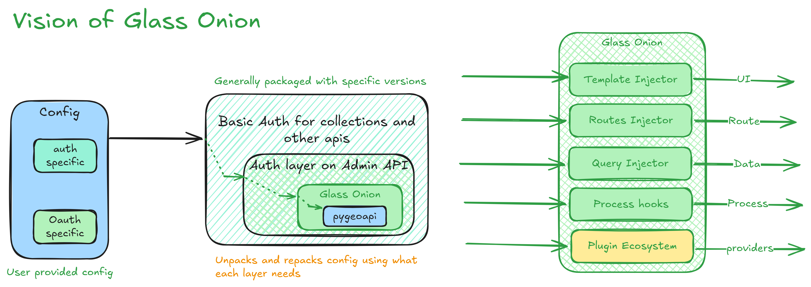

<p align="center">
 <a href="" rel="noopener">
  
 </a>
</p>
<h3 align="center">GlassOnion Framework</h3>

<div align="center">

[]()
[](LICENSE.md)

</div>

---

<p align="center">(PoC) Extending PyGeoAPI for Seamless Feature Addition & Modification</p>

<!-- SLIDES and pdf are in docs with emojis -->
- [📝 Pdf Slides of the follwing document](./docs/PyGeoAPI-GlassOnion.pdf)

## 📝 Table of Contents

- [📝 Table of Contents](#-table-of-contents)
- [🧐 Problem Statement ](#-problem-statement-)
  - [Why GlassOnion?](#why-glassonion)
- [💡 Vision ](#-vision-)
  - [Peeling Back the Layers](#peeling-back-the-layers)
- [📐 Architecture Overview ](#-architecture-overview-)
- [✨ Key Features (To Be Added) ](#-key-features-to-be-added-)
- [🧑‍🤝‍🧑 Use Cases ](#-use-cases-)
    - [Who Benefits?](#who-benefits)
- [⚙️ Try it, Break it, Know it ](#️-try-it-break-it-know-it-)
  - [Observations](#observations)
- [🚀 Features as part of PoC ](#-features-as-part-of-poc-)
- [📄 Implementation Details ](#-implementation-details-)
- [🌍 Impact \& Next Steps ](#-impact--next-steps-)
  - [Beyond the Onion](#beyond-the-onion)
- [🏁 Getting Started ](#-getting-started-)
  - [Prerequisites Knowledge ](#prerequisites-knowledge-)
- [🎉 Acknowledgments ](#-acknowledgments-)

## 🧐 Problem Statement <a name="problem-statement"></a>

### Why GlassOnion?

- **pygeoapi** is a great tool for serving geospatial data, but:
  - It lacks a simple way to add or modify features.
  - The current framework layout lacks intuitive extendability for downstream feature modification.
  - Transparency in workflows and operations is hard to achieve.

**GlassOnion** aims to solve this by extending **pygeoapi** and adding a layer of abstraction for feature addition and modification.

## 💡 Vision <a name="vision"></a>

### Peeling Back the Layers

- **Transparency**: Operations must be easy to inspect at each layer.
- **Extendability**: New features can be added as extensions to the core.
- **Interoperability**: Smooth integration with existing tools in the geo-ecosystem.

## 📐 Architecture Overview <a name="architecture-overview"></a>



## ✨ Key Features (To Be Added) <a name="key-features"></a>

1. Transparent API calls for feature management.
2. Modular plugin-based architecture for downstream services.
3. Lightweight configuration for easy scalability.
4. Real-time monitoring and diagnostics.
5. Easy integration with existing tools.
6. Extendable configuration for each tool/layer.
7. Layers of functionality, just like an onion.

## 🧑‍🤝‍🧑 Use Cases <a name="use-cases"></a>

#### Who Benefits?

- **GIS Developers**: Seamless feature additions, monitoring, and real-time data processing.
- **Data Scientists**: Transparent workflows for geospatial data processing.
- **Urban Planners**: Real-time service modifications for city modeling.

## ⚙️ Try it, Break it, Know it <a name="try-it-break-it-know-it"></a>

To verify how extensible and transparent pygeoapi currently is, I developed an authentication wrapper plugin.

### Observations

- **Well designed for flexibility**: The configuration standards are well thought out.
- **Not designed for extensibility**: Adding new features requires significant boilerplate code.
- **Documentation**: Well-written and easy to follow.
- **Understanding the codebase**: The codebase is well-structured and understandable.

## 🚀 Features as part of PoC <a name="features-as-part-of-poc"></a>

- Focused on the `flask_server`'s extensions.
- Added a new `auth` for routes in `pygeoapi`.
- Extended templates for `auth` in `pygeoapi`, allowing user customization.
- Creating "injectors" to support adding new features in the `pygeoapi` server.

Example of using injectors:
```python
from .injectors.route import apply_decorator_on_views
apply_decorator_on_views(
  APP, login_required,
    include={
      'pygeoapi.*', 'account.settings', 'account.logout',
      '!pygeoapi.landing_page', '!pygeoapi.openapi', 'pygeoapi.static',
  }
)
```

## 📄 Implementation Details <a name="implementation-details"></a>

- **pygeoapi**: For server configuration and data management.
- **Docker**: For containerization and deployment.
- **Flask middleware**: Hooks for adding new features.
- **Flask-login**: For user authentication.
- **Flask-Dance**: For OAuth2 authentication.

Natively support authentication and authorization for pygeoapi endpoints.


## 🌍 Impact & Next Steps <a name="impact-next-steps"></a>

### Beyond the Onion

- Standardize the onion framework for different use cases.
- Open-source community adoption.
- Contribute to the pygeoapi project.
- Create core layers for the onion framework (auth, logging, monitoring, etc.).
- Make all layers configurable and pass-through.

## 🏁 Getting Started <a name="getting-started"></a>

These instructions will help you get a copy of the project up and running on your local machine for development and testing purposes.

### Prerequisites Knowledge <a name="prerequisites"></a>

- Python 3.x
- Docker
- Flask
- pygeoapi

Clone the repository:
```bash
https://github.com/nitheesh-me/pygeoapi-glassonion-auth.git
cd pygeoapi-glassonion-auth
git checkout poc
```

Start the application using Docker:

```bash
docker compose build & docker compose up
```

## 🎉 Acknowledgments <a name="acknowledgments"></a>

- Special thanks to @tomkralidis and @doublebyte1 for their support and guidance.
- Some of the images used in the project are generated by Microsoft Copilot.
- The project is inspired by the need for a more transparent and extensible [pygeoapi](https://github.com/geopython/pygeoapi).

---

*Nitheesh Chandra* | *OGC Stack TechSprint 2024* | *2024/11/18 (v1.0)*
